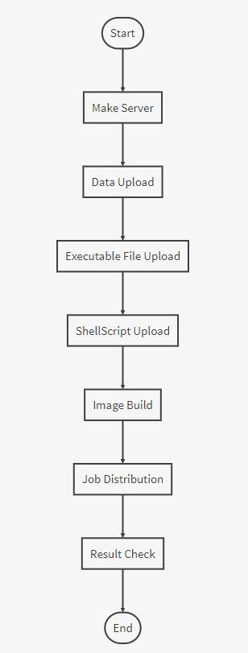

분산처리 운영 시스템 RUNNER ! 
===================

Intro
-------------
분산처리 운영시스템 RUNNER는 클러스터링 구축 및 환경설정을 클릭 한번으로 가능하게 합니다. 또한, 분산처리에 필요한 데이터 관리 및 분산처리 일 분배를 웹 UI에서 쉽게 조작이 가능하게 해줍니다.

Background
-------------
빅데이터 분석에는 분산 컴퓨팅이 필수적입니다. 하지만 이러한 분산 컴퓨팅 시스템을 구축 및 운영하기는 매우 어렵습니다. 이러한 기술적 어려움을 해결하기 위해 분산 클러스터 구축 및 운영시스템을 개발하였습니다.

Documents
-------------

> **RUNNER의 장점:**

> - 기존 클러스터 구축 과정은 단계가 복잡하고 시간이 오래 걸립니다. 이 부분을 커스터마이징 시켜 단 클릭 한번으로 가능하게 해 줍니다. 
> - 작업을 실행하는 모든 컴퓨터에 환경설정이 되어 있지 않아도 Docker 컨테이너 기술을 사용하여 작업을 실행 할 수 있습니다.
> - 사용자가 따로 경로 설정 및 기타 작업을 하지 않아도 웹 UI를 이용하여 작업에 필요한 데이터 및 파일 업로드를 손 쉽게 해 줄 수 있습니다.

Usage
-------------
Front-end
1. cd React_Project
2. npm install
3. npm start

Back-end

- Server
1. http://spring.io/tools/sts/all 접속 후 OS에 맞는 STS 설치 후 압축 해제
2. cd sts-bundle/sts-버전.RELEASE
3. ./STS
4. 서버실행

- Data Base
1. sudo apt-key adv --keyserver hkp://keyserver.ubuntu.com:80 --recv 0C49F3730359A14518585931BC711F9BA15703C6
2. echo "deb [ arch=amd64,arm64 ] http://repo.mongodb.org/apt/ubuntu xenial/mongodb-org/3.4 multiverse" | sudo tee /etc/apt/sources.list.d/mongodb-org-3.4.list
3. sudo apt update
4. sudo apt install -y mongodb-org
5. sudo service mongod start

사용순서
-------------

